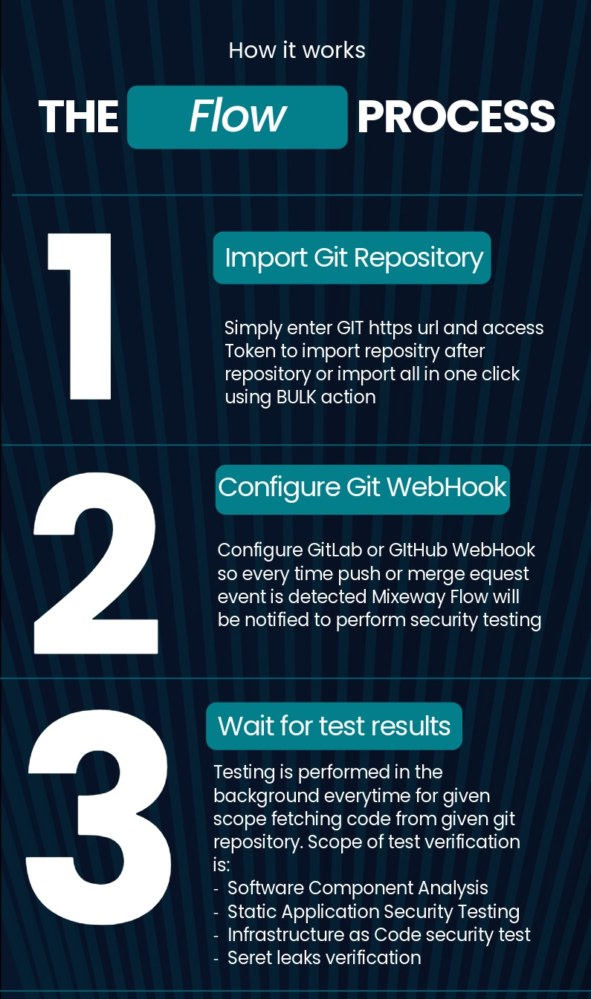
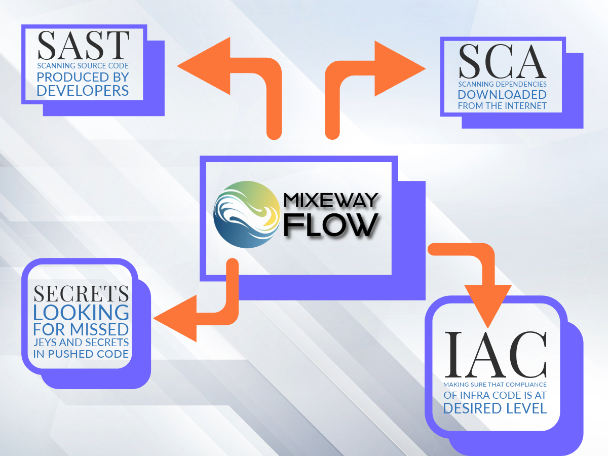
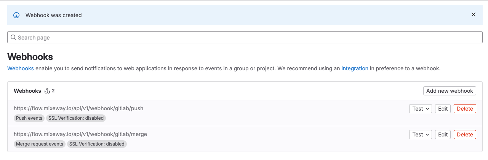
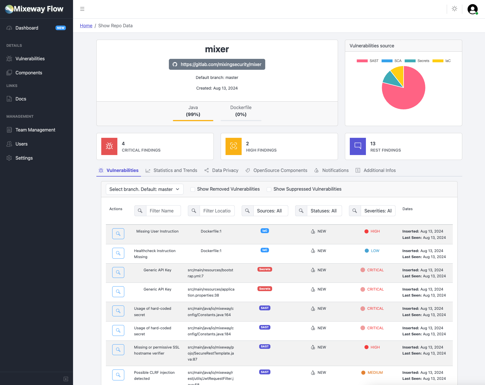

# Mixeway Flow

[](LICENSE.md)

[](https://discord.gg/76RY2Y82)
[](CONTRIBUTING.md)

## Introduction


**Mixeway Flow** is a versatile and comprehensive tool designed to serve as the ultimate Swiss army knife for DevSecOps processes. It streamlines the integration of security practices into your development and operations workflows, ensuring that your software is secure from the ground up.

Mixeway Flow comes equipped with built-in open-source scanning engines that perform thorough security validations across multiple layers of your development stack. From Infrastructure as Code (IaC) to source code and open-source libraries, Mixeway Flow ensures that potential vulnerabilities are identified and addressed early in the development lifecycle.

One of Mixeway Flow's standout features is its seamless integration with Git and CI/CD environments through webhooks. This means you don't have to spend time configuring and maintaining complex CI/CD pipelines—Mixeway Flow automatically hooks into your existing workflows to provide continuous security monitoring.

All vulnerabilities detected by Mixeway Flow are displayed in a single, unified dashboard. This dashboard offers a comprehensive view of all potential threats, with the added ability to suppress or ignore certain vulnerabilities based on specific contexts or justifications. This flexibility allows you to focus on the most critical issues without being overwhelmed by false positives or low-priority alerts.

Whether you are a developer, a security engineer, or part of a DevOps team, Mixeway Flow simplifies the integration of security into your development process, helping you build and maintain secure software with ease.

## How Mixeway Flow works



1. Register Git repository by entering repo URL and access token. At moment of initialization initial scan on last commit on default branch will be performed.
2. Configure WebHook on the GitLab or GitHub instance that will be triggered every time push or pull/merge request is detected. This trigger will send information to FLow to run the scan on the selected branch / commit or queue it if there are many events
3. Wait for the results and review detected threats

## Vulnerabilities and threats detection


Mixeway Flow has built in tools that verify security of given application across many layers. Each scan is performed in a transparent way from the CICD or developer perspective.

### SAST - engine: Bearer (https://github.com/Bearer/bearer)
> **SAST (Static Application Security Testing)** is a security technique that analyzes source code, bytecode, or binary code for vulnerabilities without executing the program. It identifies security flaws at the code level early in the development process, allowing developers to fix issues before the code is deployed. SAST scans are essential for detecting common vulnerabilities like SQL injection, cross-site scripting (XSS), and insecure coding practices.

SAST scan is performed on the source code created and written by the team's developers looking for any places that might be a source for problems related with any type of injections or other threats.

**Scan requirements**: None. Scan is performed for every change without any conditions.

### SCA - engine: SBOM & OWASP Dependency Track (https://github.com/DependencyTrack/dependency-track)
> **SCA (Software Composition Analysis)** is a security practice that identifies and manages vulnerabilities in open-source and third-party components within a software project. By analyzing the software's dependencies, SCA tools detect known vulnerabilities, license compliance issues, and outdated libraries. This helps ensure that the software remains secure and compliant with industry standards, especially when using external code that may introduce risks into the project.

Integrating SCA scanning into Your software development lifecycle help You properly manage dependencies You introduce to the codebase.

**Scan requirements**: In order to trigger SCA engine there has to be `sbom.json` file located in the root of the repository

### IAC - engine: KICS (https://github.com/Checkmarx/kics)
> **IaC (Infrastructure as Code)** vulnerability scanning is a security practice that involves analyzing IaC templates and configurations for security risks before infrastructure is provisioned. By scanning these templates, such as Terraform or CloudFormation scripts, IaC vulnerability scanning tools detect misconfigurations, insecure settings, and potential vulnerabilities that could expose infrastructure to attacks. This proactive approach helps secure cloud environments and infrastructure by identifying issues early in the development process.

This type of scan verify `Dockerfiles`, `terraform`, `kubernetes deployments` and much more configurations that can be deployed looking for the misconfiguration or bad practices to be alerted.

**Scan requirements**: None. Scan is performed for every change without any conditions.

### Secret Leaks - engine: giteaks (https://github.com/gitleaks/gitleaks)
> **Secret leaks** refer to the unintentional exposure of sensitive information, such as API keys, passwords, tokens, and other credentials, in source code, configuration files, or logs. Detecting secret leaks is crucial, as exposed secrets can be exploited by attackers to gain unauthorized access to systems, services, or data. Secret scanning tools help identify and prevent the inclusion of sensitive information in public repositories or shared code, reducing the risk of security breaches.

Most severe incidents in the Public Cloud (but not only) occurred due to misconfigurations, hardcoded keys or keys accidentally pushed to the git repository. This kind of tests help You detect such problems and give You the timeframe needed to properly rotate leaked secrets.

**Scan requirements**: None. Scan is performed for every change without any conditions.

## Installation

Explain how to install Mixeway Flow. This section could include:

- Prerequisites: access to docker hub, docker-compose command
- Hardware requirements: minimal 2CPU, 16GB ram 50GB disk space. Recommended: 4CPU, 32GB RAM 100 GB Disk space

### Option 1
```shell
git clone https://github.com/Mixeway/flow
cd flow
docker-compose up
```

### Option 2
```shell
cat <<EOF > docker-compose.yml
version: '3.8'

services:
  backend:
    image: mixeway/flow-api:latest
    container_name: flowapi_backend
    ports:
      - "8888:8888"
      - "8443:8443"
    environment:
      SSL: "TRUE"
    volumes:
      - pki_data:/etc/pki
      - dependency_track_data:/root/.dependency-track
    depends_on:
      - flowdb

  flowdb:
    image: postgres:latest
    container_name: flowdb
    ports:
      - "5432:5432"
    environment:
      POSTGRES_DB: flow
      POSTGRES_USER: flow_user
      POSTGRES_PASSWORD: flow_pass
    volumes:
      - flowdb_data:/var/lib/postgresql/data

  flow:
    image: mixeway/flow:latest
    container_name: flow_frontend
    ports:
      - "443:443"
    volumes:
      - flow_data:/etc/nginx/ssl
    depends_on:
      - backend

volumes:
  flowdb_data:
  flow_data:
  pki_data:
  dependency_track_data:
EOF
docker-compose up
```

either way what will happen:
1. Postgres database will be set up
2. Backend will be set up, self-signed certificates will be generated, dependency track will be started
3. Frontend application will be started via nginx

application will be started at: `https://localhost:443`

initial password is: `admin:admin` - You will be forced to change it during first login

## Initial configuration

1. after login create a team
2. import the repository
3. register webhook


Browse Detected vulnerabilities:



## Documentation

> Under donstruction


## Roadmap

Features to be covered in the near future:
- SSO integration (OAuth, keycloak, gitlab login)
- BugTracking automated issues (gitlab issues, JIRA)
- Merge Request commenting with scanning results

Features to be covered in the further future:
- Integration with GitHub (the same scope as GitLab)
- Enhancing SCA engin with linking code repository with docker image in registry

---
